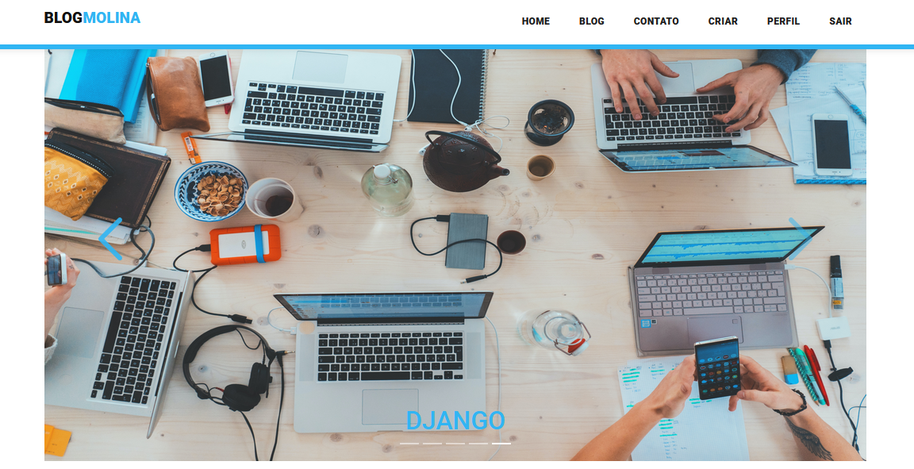
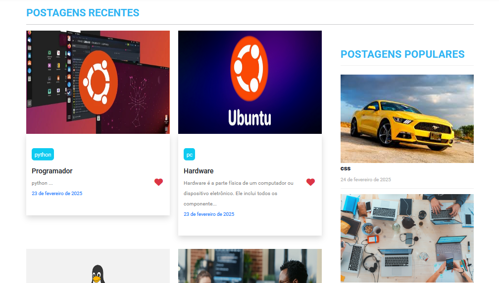
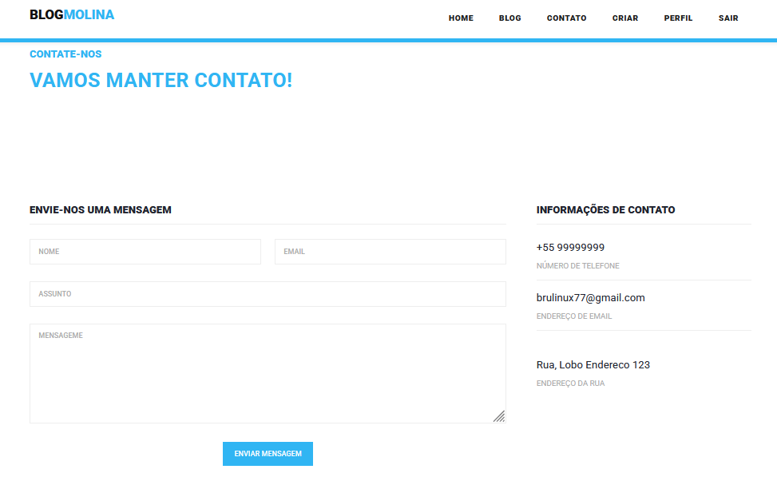
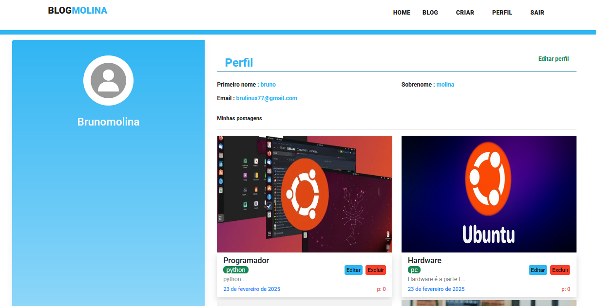
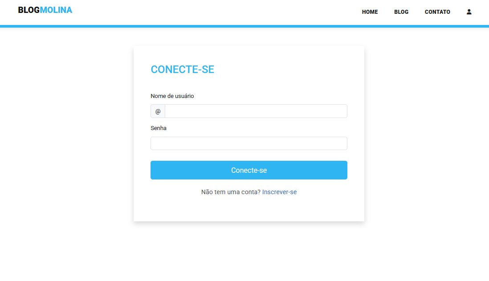

  <h1 align="center">Django Blog</h1>

## 📃 Descrição

Site de Blog
Um aplicativo de blog desenvolvido com Django contém todos os recursos essenciais de um site de blog, incluindo sistema de login e registro de usuários, criação de postagens com título, descrição e imagem, além da possibilidade de editar ou excluir postagens. O sistema também conta com um painel de administração, permitindo o gerenciamento de todas as postagens e usuários de forma centralizada.

(English)
Blog Website
A blog application developed with Django contains all the essential features of a blog website, including a login and user registration system, creation of posts with title, description and image, and the ability to edit or delete posts. The system also has an administration panel, allowing the management of all posts and users in a centralized manner.

📸 Preview

  <a href="https://meusitenovo.com/"><strong>➥ Link </strong></a>

 

 

## Características / Features 

- **Gerenciamento de Blog** – Este recurso permite realizar operações CRUD (Criar, Ler, Atualizar e Excluir) em postagens de blog, possibilitando adicionar, editar e remover conteúdos.
- **Sistema de Login** – O administrador pode acessar o sistema através do login e gerenciar todos os seus recursos.
- **Blog** – Representa a funcionalidade principal do sistema, onde as postagens são criadas e exibidas.
- **Mídia** – Nesta seção, é possível visualizar e gerenciar todos os arquivos de mídia carregados no sistema.
- **Modelo** – Refere-se à estrutura e ao design do sistema, desenvolvidos utilizando HTML, CSS e JavaScript.

(English)
- **Blog Management** – This feature allows you to perform CRUD (Create, Read, Update and Delete) operations on blog posts, allowing you to add, edit and remove content.
- **Login System** – The administrator can access the system through the login and manage all its features.
- **Blog** – Represents the main functionality of the system, where posts are created and displayed.
- **Media** – In this section, you can view and manage all media files uploaded to the system.
- **Template** – See the structure and design of the system, developed using HTML, CSS and JavaScript.

## 🛠 Construído com / Built With

- HTML
- CSS
- JavaScript
- Python
- Django
- Database 

O sistema foi desenvolvido totalmente com o Django Framework no back-end e HTML, CSS no front-end. Ele possui uma interface de usuário completa com todas as funcionalidades.

(English)
The system was developed entirely with Django Framework on the back-end and HTML, CSS on the front-end. It has a complete user interface with all the functionalities.

## ⭐️ Mostre seu apoio! / Show your support 

Deixe um ⭐️ se você gostou deste projeto!

(English)Leave a ⭐️ if you liked this project!

